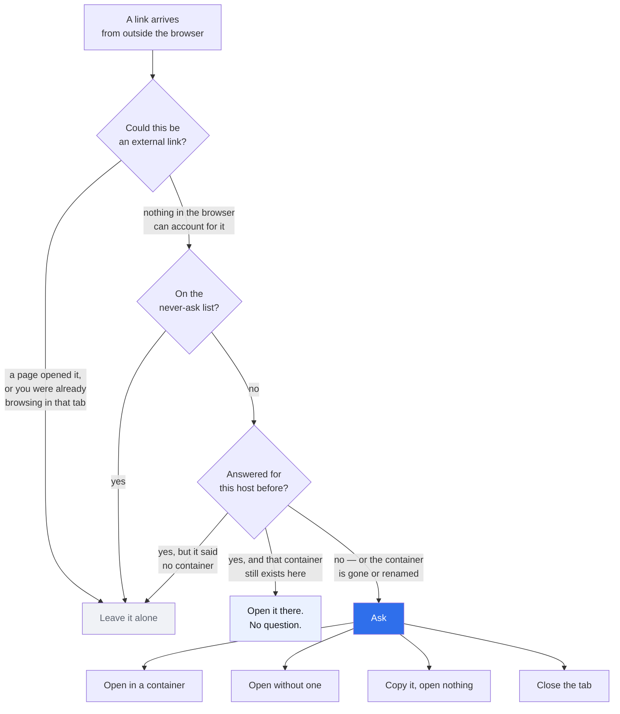
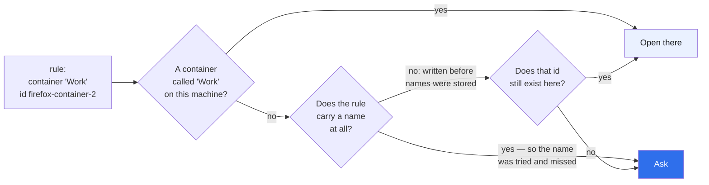

# linkward

**Asks where a link should open — before it opens.**

When another application hands a link to your browser — Slack, Outlook, Teams, a
terminal — it lands wherever the browser felt like putting it. Usually the wrong
identity. linkward stops it first and asks:

- open it in **this container**,
- open it **without** one,
- or **copy the link and open nothing at all**.

On Firefox the request is stopped **before it is sent**, so the page is never
fetched, no cookie is set, and no session is started in the wrong container.

Answer once for a host and tick **remember**, and it stops asking about that
one. Those live in the settings page, where you can move a host to another
container or drop it to be asked again — and they follow your browser account,
because they are stored by the container's **name**, not by the id the browser
minted for it on one machine. A rule for a container this browser does not have
is never guessed at: it asks.

## What it does with a link



Every branch that is not the blue one errs towards **not** interrupting you.
The one that matters most is "the container is gone or renamed": a remembered
rule that cannot be resolved on this machine **asks** rather than guessing,
because opening the wrong identity is the failure this exists to prevent.

## The keyboard

The picker interrupts something, and it is seen many times a day, so it does not
insist on the mouse:

| Key     |                                                                               |
| ------- | ----------------------------------------------------------------------------- |
| `1`–`9` | open in the nth container                                                     |
| `Enter` | the one offered first — the container used last, or plainly if there are none |
| `c`     | copy the link, open nothing                                                   |
| `Esc`   | close the tab                                                                 |

Anything with ⌘, Ctrl or Alt held is left alone: those belong to the browser,
and taking ⌘C from somebody copying the address off the page would be its own
small betrayal.

## Why it asked

The page says how long ago the tab appeared and what it could not account for:

> Asked because this tab was opened 2.4s ago and nothing in the browser accounts
> for it — no page opened it, and you had not been browsing in it.

This is not decoration. The detection is a process of **exclusion**, so when it
gets one wrong there has to be something to point at — for whoever was
interrupted, and for whoever they report it to.

## The honest part, up front

**Firefox does not tell an extension that a link came from another
application.** It knows — `isExternal`, in `BrowserDOMWindow.sys.mjs` — and it
does not expose it. What an extension sees for a link handed over by Slack is
`transitionType: "link"`: byte for byte the same as a click on a web page.
[Mozilla's own bug for this](https://bugzilla.mozilla.org/show_bug.cgi?id=1774127)
has been open since 2022.

So linkward does not detect external links. It **excludes** everything it can
positively identify as something else — a tab with an opener, a navigation a
document started, a tab you have already been browsing in, and a tab that
started on one of the browser's own pages rather than on a link — and asks about
what is left. Every rule errs towards **not** asking, because interrupting a link you
clicked yourself is the failure that gets an add-on uninstalled.

The rules are one small, pure file — [`src/lib/candidates.js`](src/lib/candidates.js)
— and it is the most heavily tested thing in the repo.

## Chrome

```mermaid
sequenceDiagram
    participant App as Slack, Outlook, …
    participant B as Browser
    participant L as linkward
    participant S as The server

    rect rgb(234, 241, 255)
    Note over App,S: Firefox — before the request is sent
    App->>B: open this link
    B->>L: onBeforeRequest (blocking)
    L-->>B: hold it
    L->>L: ask, or apply a remembered rule
    L->>B: open in the chosen container
    B->>S: first and only request
    end

    rect rgb(240, 242, 246)
    Note over App,S: Chrome — it cannot be held
    App->>B: open this link
    B->>L: onBeforeNavigate
    Note right of L: fires first, but cannot<br/>hold anything: MV3 has<br/>no blocking form
    B->>S: request goes while linkward decides
    L->>B: turn the tab around
    Note right of L: the page may flash;<br/>no containers to offer
    end
```

Two things are different, and the picker says both on the page rather than
hiding them:

- **Chrome MV3 removed blocking `webRequest`**, so linkward can only turn the
  tab around once the navigation has begun. The page may flash.
- **No extension can open a tab in another Chrome profile.** `tabs.create`
  takes a window to aim at and no profile, because an extension in one profile
  cannot see that the others exist. A profile can only be chosen before the
  browser is handed the link — [what actually works](#chromium-profiles).

Containers are a Firefox feature. The Chrome build ships without the
container permissions at all.

## Permissions

Nothing is granted at install. Everything below is requested from the options
page, in one call, when you switch the feature on — and handed back when you
switch it off.

| Permission                         | Why                                                                                                                                                                   |
| ---------------------------------- | --------------------------------------------------------------------------------------------------------------------------------------------------------------------- |
| `<all_urls>`                       | The only one you actually see: _"Access your data for all websites"_. It is what lets linkward stop a page before it loads. Without it there is nothing to intercept. |
| `webRequest`, `webRequestBlocking` | Firefox only. Silently granted. Stopping the request rather than reacting after it.                                                                                   |
| `webNavigation`                    | Chrome only. There is no blocking form there.                                                                                                                         |
| `contextualIdentities`, `cookies`  | Firefox only, required by the manifest: reading your containers' names and colours, and honouring a `cookieStoreId` when opening.                                     |

linkward reads no page content, stores nothing about where you go, and sends
nothing anywhere. See [PRIVACY.md](PRIVACY.md).

## Install

In review at both stores.

```bash
npm install
npm run build:firefox   # dist-firefox/
npm run build           # dist/
```

Firefox: `about:debugging#/runtime/this-firefox` → **Load Temporary Add-on** →
`dist-firefox/manifest.json`.
Chrome: `chrome://extensions` → **Developer mode** → **Load unpacked** → `dist/`.

**Then switch it on.** linkward opens its settings page by itself the first
time, and it does nothing at all until the switch there is on: the access it
needs is asked for at that moment, not at install, and a browser only grants it
on a click. Before that, links open exactly as they always did — which looks
identical to a broken install, so the page says so in as many words.

## The settings file

**Settings → Settings file → Export** writes the settings that travel, and the
remembered hosts, as JSON — two fields are left out on purpose, see below.
**Import** replaces both. The shape is stable and small enough to edit by hand:

```json
{
  "format": "linkward-settings",
  "version": 1,
  "settings": {
    "neverAsk": ["intranet.example", "mail.example"],
    "rememberPrompt": "ticked"
  },
  "rules": {
    "docs.example.com": {
      "container": "Work",
      "cookieStoreId": "firefox-container-2"
    },
    "shop.example": {
      "container": null,
      "cookieStoreId": "",
      "plain": true
    }
  }
}
```

| Field                       | Meaning                                                                                                              |
| --------------------------- | -------------------------------------------------------------------------------------------------------------------- |
| `format`                    | Always `linkward-settings`. A file without it is refused, rather than half-read.                                     |
| `version`                   | `1`. A **higher** number is refused: a newer linkward may mean something else by these fields. A lower one is read.  |
| `settings.neverAsk`         | Hosts to leave alone entirely. Subdomains included. Trimmed, de-duplicated and sorted on import.                     |
| `settings.rememberChoices`  | Whether the picker's tick box starts ticked.                                                                         |
| `rules`                     | One entry per remembered host, keyed by the host in lower case.                                                      |
| `rules[host].container`     | The container's **name**. This is what a rule is matched on.                                                         |
| `rules[host].cookieStoreId` | The id that name had on the machine that wrote the file. Only ever used for a rule that carries no name — see below. |
| `rules[host].plain`         | `true` means "always open this host with no container". Absent otherwise.                                            |

Two fields are deliberately **not** in the file:

- **`enabled`** stands for a permission a browser only grants on a click, and a
  file cannot click. Importing it would produce a page claiming the feature is
  on while nothing is listening.
- **`lastContainer`** is a `cookieStoreId`, which means a different container on
  the machine the file arrives at.

### Why a rule stores a name and an id



A `cookieStoreId` is minted per profile and **reused**. Syncing one alone would
mean the same rule opening a different container on another machine — a rule
for `Admin` whose old id now belongs to `Work` would open Work, silently. So
the id is a fallback for legacy rules only, and a named rule that cannot be
matched by name asks.

## Seeing it work

A link clicked on a page is deliberately never intercepted, so demonstrating
this from inside the browser demonstrates nothing. The script hands links to the
operating system instead, the way a mail client does:

```bash
node scripts/demo.mjs                    # one link
node scripts/demo.mjs --all              # the tour, one at a time
node scripts/demo.mjs --browser=Firefox  # ignore the default browser
node scripts/demo.mjs https://your.intranet/page
```

### Chromium profiles

**No extension can open a tab in another Chromium profile.** Not linkward, not
anything — this is worth stating plainly, because "not supported yet" would
imply it is coming.

`chrome.tabs.create` takes a **window** to aim at and nothing else; there is no
profile parameter, and `chrome.windows.create` has none either. The reason is
below the API: an extension installed in one profile cannot see that the others
exist. Profiles are the isolation boundary, and extensions live inside one.

The same holds in Vivaldi, and for its Workspaces — Vivaldi's own forum staff
put per-workspace extension settings down to "Vivaldi/Chromium core
restrictions", and routing a URL to a profile by rule is an open feature
request, not an API.

So a profile can only be chosen **before the browser is handed the link**, by
whatever hands it over:

| Route                                                                                                                           | What it costs                                                                                                          |
| ------------------------------------------------------------------------------------------------------------------------------- | ---------------------------------------------------------------------------------------------------------------------- |
| Command line — `vivaldi --profile-directory="Profile 2" <url>`                                                                  | nothing; works today                                                                                                   |
| An OS-level router — [Choosy](https://www.choosyosx.com), [BrowserOSaurus](https://github.com/will-stone/browserosaurus), Velja | a second app, set as the default browser                                                                               |
| A native-messaging host                                                                                                         | a binary and a manifest per machine, installed outside the browser, and the kind of thing store reviewers read closely |

#### "Can the browser not just call itself?"

It can — and that is exactly what the first two routes do. The catch is that
**an extension is not a process.** It is JavaScript in a sandbox with no way to
start one, so every route to `vivaldi --profile-directory=…` runs through
something registered with the operating system.

The obvious shortcut is a custom URL scheme: register `linkward://` with the OS,
have the picker navigate to it, let the OS launch the handler. It works, and it
saves the native-messaging manifest — but **not the installer**. In both models
the native application is installed by the OS's own machinery rather than by the
browser, so a user still has to install something.

And it would be worse to use. Chromium's list of schemes that may launch without
asking is compiled in, not built from what is on the machine, so a custom scheme
prompts **every single time**: linkward asks where the link should go, then
Chromium asks whether it may open linkward. Two dialogs for one link. Only an
enterprise policy (`AutoLaunchProtocolsFromOrigins`) removes the second, and
that is not something an extension can ship.

So linkward ships none of these on purpose. It is an extension that needs one
switch and no installer — a native host would trade that for a feature only
Chromium users could ever get, while Firefox already does the whole job inside
the browser, with containers, and no helper at all.

`scripts/demo.mjs` takes the first route:

```bash
node scripts/demo.mjs --browser=Vivaldi --profile="Profile 1" https://example.com/
# which is:  open -a Vivaldi -n --args --profile-directory="Profile 1" <url>
```

Profile directories are `Default`, `Profile 1`, `Profile 2`, … — the folder
names under the browser's user-data directory, not the names shown in its UI.

Two more things follow from profiles being sealed off, and they surprise people:

- **Extensions are per profile.** linkward installed in one is not installed in
  the other; the second profile opens links exactly as it did before.
- **Installing it in both does not let it move a link between them.** It only
  means the question gets asked in whichever profile the link lands in.

#### The container extensions for Chromium solve a different problem

There are extensions that bring Firefox-style containers to Chromium —
SessionBox, Cookie Profile Switcher, and several free imitations of Mozilla's
Multi-Account Containers. They are real and some of them are good, but they are
not an answer to the question on this page.

What they give you is **isolated sessions inside one profile**: a per-tab cookie
jar, swapped through the `cookies` API, so you can be signed in twice to the
same site. What they cannot give you is **another profile**, because that is the
boundary described above and no extension crosses it.

The isolation is also thinner than Firefox's. Cookies and site storage are
separated; the fingerprint, the IP and the browser build are not, so every
session still looks like the same machine. Firefox containers have the same
ceiling — neither changes your fingerprint — but they are implemented by the
browser rather than reconstructed on top of it, and users report the extension
kind losing sessions after a while.

If you use one, the two get along by staying out of each other's way: put the
hosts it manages on **the never-ask list**, and linkward never reaches them.
There is nothing to wire up and no setting connecting them — those hosts simply
never become a question.

That is the whole of the interoperability, and deliberately so. SessionBox has
no `externally_connectable` surface and no deep-link scheme; its own support
pages say the extension has no API. The one supported route is an npm toolkit
driven by an API key from a local Node process — the helper-process cost again,
with a third party and a key on top.

linkward does not do this and will not. Holding somebody's cookie jars is a
different product with a different failure mode: when it goes wrong, you are
silently signed in as the wrong person, which is precisely what this exists to
prevent.

Firefox has none of this trouble: containers live inside one profile, so the
add-on really can open the link in the right one.

### If Firefox has no containers yet

Containers are **built into Firefox** — linkward reads them through
`contextualIdentities` and needs nothing else. What Firefox does not give you is
an obvious way to _make_ one, which is why almost everybody has
[Multi-Account Containers](https://addons.mozilla.org/firefox/addon/multi-account-containers/),
Mozilla's own add-on, installed to create, name and colour them.

linkward does not depend on it and does not talk to it. It lists whatever
containers exist, whoever made them, and there is no setting connecting the two.
Install it, make the containers you want, and they appear in the picker.

The picker says as much when it finds none, rather than reporting an empty list
and leaving you to work out why.

## Development

```bash
npm test          # vitest
npm run ci        # lint + format + coverage + package, the same gate CI runs
```

No bundler and no runtime dependencies: the source under `src/` **is** the
artifact. An extension that intercepts navigations should be readable end to end
by whoever reviews it.

## Publishing

Two stores, one release workflow, and a setup script that creates the Chrome
Web Store item and writes every secret so nobody has to click through two
dashboards. What is left is the part no API can do — the store listing and the
permission justifications.

**→ [docs/publishing.md](docs/publishing.md)**

## Author & License

Sebastian Winterberger · MIT
