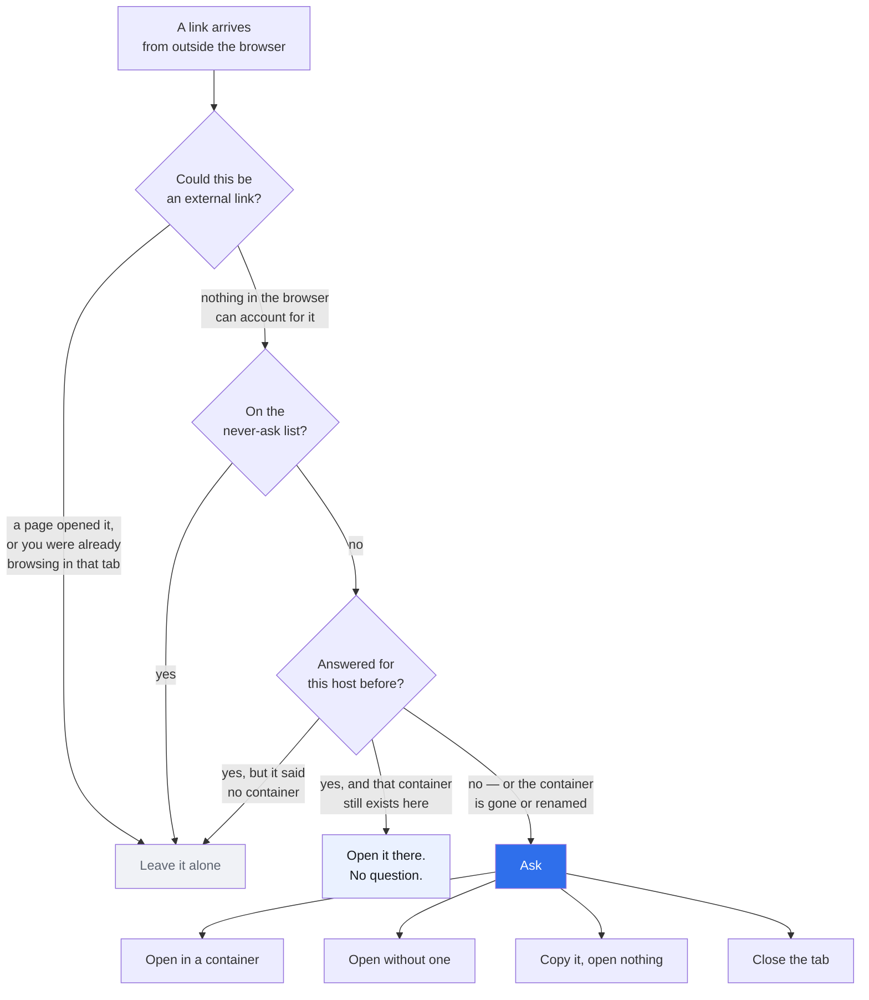
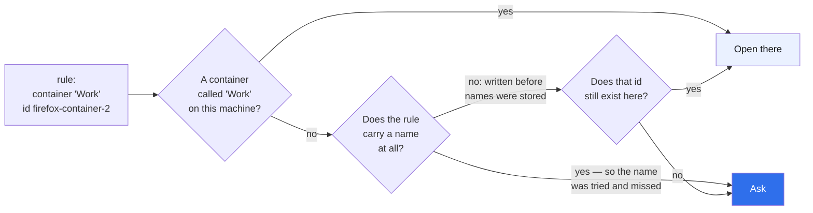

# linkward

**Asks where a link should open — before it opens.**

When another application hands a link to your browser — Slack, Outlook, Teams, a
terminal — it lands wherever the browser felt like putting it. Usually the wrong
identity. linkward stops it first and asks:

- open it in **this container**,
- open it **without** one,
- or **copy the link and open nothing at all**.

On Firefox the request is stopped **before it is sent**, so the page is never
fetched, no cookie is set, and no session is started in the wrong container.

Answer once for a host and tick **remember**, and it stops asking about that
one. Those live in the settings page, where you can move a host to another
container or drop it to be asked again — and they follow your browser account,
because they are stored by the container's **name**, not by the id the browser
minted for it on one machine. A rule for a container this browser does not have
is never guessed at: it asks.

## What it does with a link



Every branch that is not the blue one errs towards **not** interrupting you.
The one that matters most is "the container is gone or renamed": a remembered
rule that cannot be resolved on this machine **asks** rather than guessing,
because opening the wrong identity is the failure this exists to prevent.

## The honest part, up front

**Firefox does not tell an extension that a link came from another
application.** It knows — `isExternal`, in `BrowserDOMWindow.sys.mjs` — and it
does not expose it. What an extension sees for a link handed over by Slack is
`transitionType: "link"`: byte for byte the same as a click on a web page.
[Mozilla's own bug for this](https://bugzilla.mozilla.org/show_bug.cgi?id=1774127)
has been open since 2022.

So linkward does not detect external links. It **excludes** everything it can
positively identify as something else — a tab with an opener, a navigation a
document started, a tab you have already been browsing in — and asks about what
is left. Every rule errs towards **not** asking, because interrupting a link you
clicked yourself is the failure that gets an add-on uninstalled.

The rules are one small, pure file — [`src/lib/candidates.js`](src/lib/candidates.js)
— and it is the most heavily tested thing in the repo.

## Chrome

```mermaid
sequenceDiagram
    participant App as Slack, Outlook, …
    participant B as Browser
    participant L as linkward
    participant S as The server

    rect rgb(234, 241, 255)
    Note over App,S: Firefox — before the request is sent
    App->>B: open this link
    B->>L: onBeforeRequest (blocking)
    L-->>B: hold it
    L->>L: ask, or apply a remembered rule
    L->>B: open in the chosen container
    B->>S: first and only request
    end

    rect rgb(240, 242, 246)
    Note over App,S: Chrome — it cannot be held
    App->>B: open this link
    B->>L: onBeforeNavigate
    Note right of L: fires first, but cannot<br/>hold anything: MV3 has<br/>no blocking form
    B->>S: request goes while linkward decides
    L->>B: turn the tab around
    Note right of L: the page may flash;<br/>no containers to offer
    end
```

Two things are different, and the picker says both on the page rather than
hiding them:

- **Chrome MV3 removed blocking `webRequest`**, so linkward can only turn the
  tab around once the navigation has begun. The page may flash.
- **No extension can open a tab in another Chrome profile.** The isolation is
  enforced inside Chromium, not by convention. On Chrome, linkward can hand you
  the link and nothing more — use Chrome's own right-click **"Open Link as
  ‹Profile›"** on the original link, which has been there since Chrome 48.

Containers are a Firefox feature. The Chrome build ships without the
container permissions at all.

## Permissions

Nothing is granted at install. Everything below is requested from the options
page, in one call, when you switch the feature on — and handed back when you
switch it off.

| Permission                         | Why                                                                                                                                                                   |
| ---------------------------------- | --------------------------------------------------------------------------------------------------------------------------------------------------------------------- |
| `<all_urls>`                       | The only one you actually see: _"Access your data for all websites"_. It is what lets linkward stop a page before it loads. Without it there is nothing to intercept. |
| `webRequest`, `webRequestBlocking` | Firefox only. Silently granted. Stopping the request rather than reacting after it.                                                                                   |
| `webNavigation`                    | Chrome only. There is no blocking form there.                                                                                                                         |
| `contextualIdentities`, `cookies`  | Firefox only, required by the manifest: reading your containers' names and colours, and honouring a `cookieStoreId` when opening.                                     |

linkward reads no page content, stores nothing about where you go, and sends
nothing anywhere. See [PRIVACY.md](PRIVACY.md).

## Install

In review at both stores.

```bash
npm install
npm run build:firefox   # dist-firefox/
npm run build           # dist/
```

Firefox: `about:debugging#/runtime/this-firefox` → **Load Temporary Add-on** →
`dist-firefox/manifest.json`.
Chrome: `chrome://extensions` → **Developer mode** → **Load unpacked** → `dist/`.

**Then switch it on.** linkward opens its settings page by itself the first
time, and it does nothing at all until the switch there is on: the access it
needs is asked for at that moment, not at install, and a browser only grants it
on a click. Before that, links open exactly as they always did — which looks
identical to a broken install, so the page says so in as many words.

## The settings file

**Settings → Settings file → Export** writes the settings that travel, and the
remembered hosts, as JSON — two fields are left out on purpose, see below.
**Import** replaces both. The shape is stable and small enough to edit by hand:

```json
{
  "format": "linkward-settings",
  "version": 1,
  "settings": {
    "neverAsk": ["intranet.example", "mail.example"],
    "rememberPrompt": "ticked"
  },
  "rules": {
    "docs.example.com": {
      "container": "Work",
      "cookieStoreId": "firefox-container-2"
    },
    "shop.example": {
      "container": null,
      "cookieStoreId": "",
      "plain": true
    }
  }
}
```

| Field                       | Meaning                                                                                                              |
| --------------------------- | -------------------------------------------------------------------------------------------------------------------- |
| `format`                    | Always `linkward-settings`. A file without it is refused, rather than half-read.                                     |
| `version`                   | `1`. A **higher** number is refused: a newer linkward may mean something else by these fields. A lower one is read.  |
| `settings.neverAsk`         | Hosts to leave alone entirely. Subdomains included. Trimmed, de-duplicated and sorted on import.                     |
| `settings.rememberChoices`  | Whether the picker's tick box starts ticked.                                                                         |
| `rules`                     | One entry per remembered host, keyed by the host in lower case.                                                      |
| `rules[host].container`     | The container's **name**. This is what a rule is matched on.                                                         |
| `rules[host].cookieStoreId` | The id that name had on the machine that wrote the file. Only ever used for a rule that carries no name — see below. |
| `rules[host].plain`         | `true` means "always open this host with no container". Absent otherwise.                                            |

Two fields are deliberately **not** in the file:

- **`enabled`** stands for a permission a browser only grants on a click, and a
  file cannot click. Importing it would produce a page claiming the feature is
  on while nothing is listening.
- **`lastContainer`** is a `cookieStoreId`, which means a different container on
  the machine the file arrives at.

### Why a rule stores a name and an id



A `cookieStoreId` is minted per profile and **reused**. Syncing one alone would
mean the same rule opening a different container on another machine — a rule
for `Admin` whose old id now belongs to `Work` would open Work, silently. So
the id is a fallback for legacy rules only, and a named rule that cannot be
matched by name asks.

## Seeing it work

A link clicked on a page is deliberately never intercepted, so demonstrating
this from inside the browser demonstrates nothing. The script hands links to the
operating system instead, the way a mail client does:

```bash
node scripts/demo.mjs                    # one link
node scripts/demo.mjs --all              # the tour, one at a time
node scripts/demo.mjs --browser=Firefox  # ignore the default browser
node scripts/demo.mjs https://your.intranet/page
```

## Development

```bash
npm test          # vitest
npm run ci        # lint + format + coverage + package, the same gate CI runs
```

No bundler and no runtime dependencies: the source under `src/` **is** the
artifact. An extension that intercepts navigations should be readable end to end
by whoever reviews it.

## Publishing

Two stores, one release workflow, and a setup script that creates the Chrome
Web Store item and writes every secret so nobody has to click through two
dashboards. What is left is the part no API can do — the store listing and the
permission justifications.

**→ [docs/publishing.md](docs/publishing.md)**

## Author & License

Sebastian Winterberger · MIT
